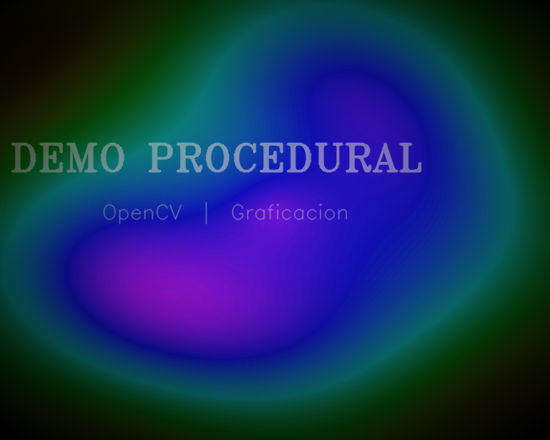
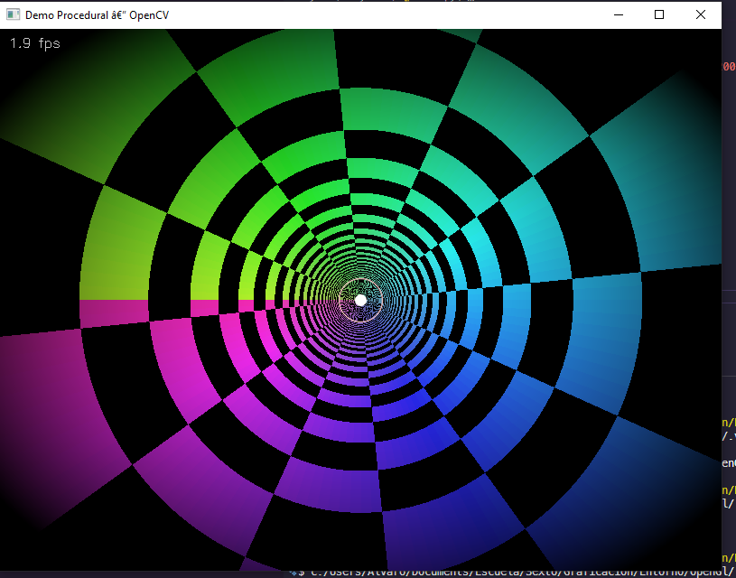
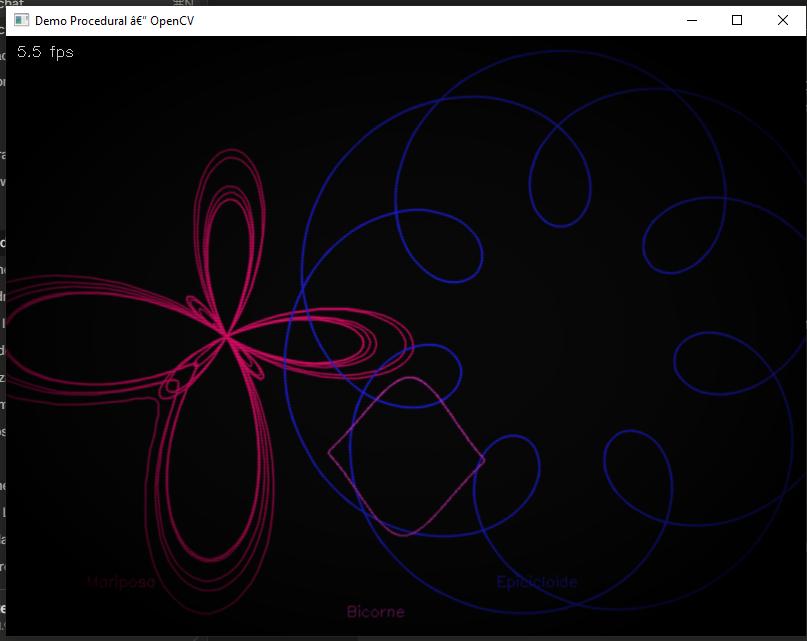

# Demo Procedural Con OpenCv

*Agente:* CORTES VALENCIA ALVARO JESUS
*Grupo:* B
*Coronel:* ALCARAZ CHAVEZ JESUS EDUARDO

## La Historia

En el archivo de telemetría del observatorio aparece un demo minimalista: sin texturas descargadas, sin modelos importados… y sin embargo muestra un mundo completo hecho con matemáticas y primitivas de dibujo.

La dirección te asigna una misión: *construir un demo procedural usando OpenCV*

Las Pistas (qué significa “demo” en este curso)
No buscamos un demo 64k real; buscamos un demo de graficación:

Procedural: lo visual se genera en tiempo real (ecuaciones/algoritmos).
Temario: se nota el uso de transformaciones, curvas y composición.
Timeline: avanza con el tiempo (no con clicks).
OpenCV: dibujo por primitivas y/o transformaciones de imagen.

Objetivo (qué debe hacer tu demo)
Construye un demo que muestre, de forma clara, temas del curso

## Capturas de Pantalla

### Escena de apertura

### Escena 1

### Escena 2

## Tabla comparativa

| Aspecto | Código base (ejemplo) | Demo final (proyecto) |
|---|---|---|
| **Escenas** | 6 escenas predefinidas: créditos, Lissajous, rosa polar, espirógrafo, partículas, fuego | 6 escenas nuevas: plasma HSV, túnel 2D, curvas exóticas, Julia animado, teselas geométricas, Mandelbrot zoom |
| **Curvas paramétricas** | Lissajous, rosa polar, hipotrocoide (spirograph) | Mariposa (Fay), epicicloide, bicorne, espiral de Arquímedes, Julia, Mandelbrot |
| **Tipo de figuras** | Curvas polares y espirografos | Fractales, curvas algebraicas, demoscene, polígonos procedurales |
| **Transformaciones** | Ninguna explícita con matriz afín | Rotación (2×2), shear horizontal (2×3), escala pulsante por celda |
| **Composición de capas** | `addWeighted` solo en transiciones | `addWeighted` dentro de escenas (bloom, fractal + espiral) |
| **Fractales** | No implementados | Julia Set animado + Mandelbrot con zoom dinámico |
| **Post-FX** | Vignette, scanlines, posterize (globales) | Vignette, scanlines, posterize, aberración cromática, bloom por escena |
| **Fondo** | Degradado HSV vertical (`background_hsv_gradient`) | Cada escena genera su propio fondo procedural distinto |
| **Resolución de cómputo** | 800×600 en todas las operaciones | Fractales a 400×300 + upscale bilinear (4× menos píxeles) |
| **Precisión numérica** | `float64` en fractales | `float32` en todo (2× más rápido en CPU) |
| **Coordenadas estáticas** | Recalculadas cada frame | Precalculadas una sola vez en `_build_static_tables()` |
| **Early-exit en iteraciones** | No implementado | Máscara `alive` acumulada: excluye píxeles ya escapados |
| **Caché de frames** | Caché básico por `t` en Mandelbrot | Caché por índice de frame par (recalcula cada 2 frames) |
| **LUT de colores** | `hsv_to_bgr()` llamada por celda (~96×/frame en tiles) | LUT de 180 entradas precalculada; lookup O(1) por celda |
| **Contador de FPS** | No incluido | Overlay en pantalla para monitoreo en tiempo real |
| **Rendimiento estimado** | ~10 fps en CPU sin optimizar | ~25–30 fps en CPU con las optimizaciones aplicadas |

## Conclusion

El desarrollo de este demo procedural permitió aplicar de forma integrada los conceptos fundamentales del curso: curvas paramétricas, transformaciones afines y composición de capas.

Se sustituyeron las figuras proporcionadas en el ejemplo por unas más elavoradas:

- la curva mariposa de Fay
- la epicicloide
- el conjunto de Julia
- el de Mandelbrot
