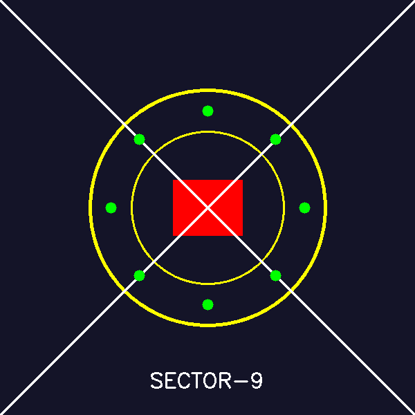
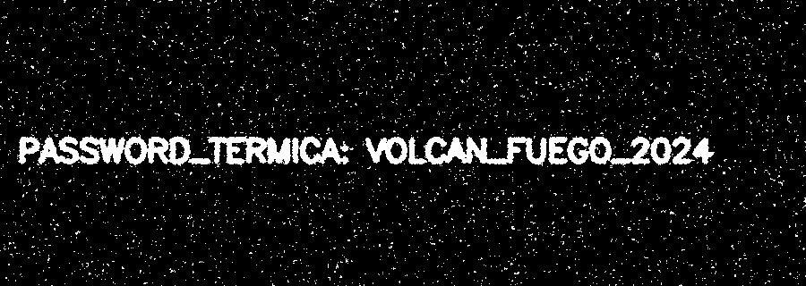
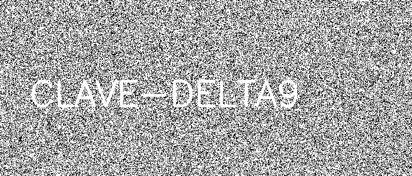
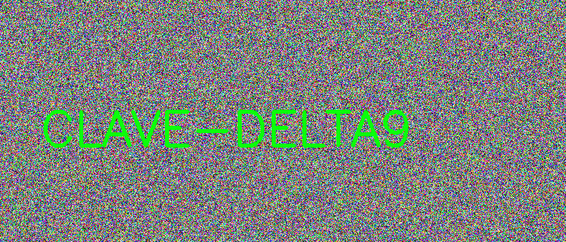

# Reporte de Misión: Graficación Táctica II
**Agente Especial:** [Alvaro Jesús Cortés Valencia / 23121050]

# Mision1
## 1. Introduccion
En esta practica se trabajo con una imagen llamada m1_oscura.png que a simple vista parecia completamente negra. El objetivo era recuperar la imagen oculta aplicando el operador puntual inverso al que uso el "enemigo" para oscurecerla.
Un operador puntual es una transformacion que modifica el valor de cada pixel de forma independiente, sin tomar en cuenta los pixeles vecinos. En este caso, el operador aplicado fue una division entre 50, lo que redujo los valores de brillo a un rango casi imperceptible (entre 1 y 5 aproximadamente).
## 2. Marco Teorico
Se llama operador puntual a cualquier funcion T que transforma el valor de un pixel P(x,y) basandose unicamente en su propio valor original, sin depender de sus vecinos:
P_salida = T( P_entrada )
En esta practica el enemigo aplico T(P) = P / 50, lo que redujo drasticamente el brillo. Para recuperar la imagen se necesita aplicar el operador inverso: multiplicar por 50.
P_recuperado = clip( P_ofuscado * 50 , 0, 255 )
La funcion clip es necesaria porque al multiplicar por 50 algunos valores podrian exceder el maximo permitido de 255 en una imagen de 8 bits, lo que causaria desbordamiento (overflow) y resultados incorrectos.
## 3. Desarrollo

### 3.1 Modo Raw: ciclos anidados
Se implemento el operador puntual inverso recorriendo cada pixel de la imagen con tres ciclos anidados: uno para las filas, otro para las columnas y otro para los canales de color (B, G, R). A cada valor se le multiplico por 50 y al final se aplico np.clip para evitar valores fuera del rango valido.

El motivo de usar int32 antes de multiplicar es que las imagenes se almacenan en formato uint8, que solo puede guardar valores de 0 a 255. Si se multiplica directamente en uint8, cualquier resultado mayor a 255 se desborda y da un valor incorrecto. Al convertir a int32 primero, el numero puede crecer sin problemas y despues el clip lo regresa al rango correcto.

### 3.2 Modo Vectorizado: NumPy
La segunda implementacion usa operaciones vectorizadas de NumPy, que aplican la misma operacion a toda la matriz de una sola vez sin necesidad de ciclos. Esto es mucho mas rapido y el codigo queda mas simple:
Ambos metodos producen exactamente el mismo resultado visual. La diferencia es que el modo raw es mucho mas lento porque recorre pixel por pixel, mientras que NumPy procesa toda la imagen en paralelo internamente.

## 4. Resultados
Al aplicar el operador puntual inverso (multiplicacion por 50 con clip) en ambos modos, la imagen que parecia completamente negra revelo su contenido oculto. Los dos metodos generaron imagenes identicas, lo que confirma que la logica es correcta.
La imagen original estaba oscurecida por un factor de 50.
Los valores de pixel en la imagen oscura estaban entre 1 y 5.
Despues de multiplicar por 50 y aplicar clip, los valores quedaron en el rango 50-255.
Ambas implementaciones (raw y vectorizada) produjeron el mismo resultado.

[text](Mision1/mision1.py)

# MISION 2

En esta actividad se trabajó con transformaciones geométricas utilizando las librerías NumPy y OpenCV en Python, con el objetivo de reconstruir un código QR dividido en dos partes y alterado en su posición original.

Primero, se creó un lienzo en blanco de dimensiones 400x400 píxeles mediante la función np.zeros, el cual serviría como base para colocar ambas mitades del código QR. Posteriormente, se cargaron las dos imágenes correspondientes a las mitades del QR.

La mitad superior fue procesada mediante una transformación de traslación utilizando una matriz afín aplicada con cv2.warpAffine, con el fin de posicionarla en el origen del lienzo (coordenadas 0,0).

Por otro lado, la mitad inferior fue sometida a una rotación de 180 grados sobre su propio centro. Para ello, se utilizó la función cv2.getRotationMatrix2D para generar la matriz de rotación, la cual fue aplicada igualmente con cv2.warpAffine.

Finalmente, ambas mitades ya corregidas fueron colocadas en el lienzo: la primera en la parte superior y la segunda en la parte inferior. Como resultado, se logró reconstruir el código QR completo, permitiendo su correcta visualización y potencial escaneo.
[text](Mision2/Mision2)

# MISION 3

En esta actividad se desarrolló un sello geométrico utilizando primitivas de dibujo en OpenCV, aplicando conceptos de simetría y posicionamiento en un plano cartesiano.

Se inició creando un lienzo de 600x600 píxeles con un color base en formato BGR (40, 20, 20). Posteriormente, se dibujaron dos círculos concéntricos de color amarillo, uno exterior y otro interior, respetando los radios y grosores especificados.

A continuación, se agregó un rectángulo rojo sólido en el centro del lienzo, seguido del trazo de dos líneas diagonales blancas que forman una “X” de esquina a esquina, aportando simetría visual al diseño.

Para la marca de autenticidad, se implementó una distribución simétrica de 8 círculos verdes alrededor del centro. Esta disposición se logró mediante el uso de funciones trigonométricas (seno y coseno), dividiendo la circunferencia en partes iguales y ubicando cada punto a una distancia fija del centro.

Finalmente, se añadió el texto “SECTOR-9” en la parte inferior de la imagen, centrado horizontalmente. El resultado fue guardado como **m3_sello_forjado_v2.png**, cumpliendo con todas las especificaciones solicitadas.

[text](Mision3/Mision3.py)

# MISION 4 
En esta actividad se trabajó con técnicas de procesamiento de imágenes orientadas a la reducción de ruido y segmentación por color utilizando OpenCV y NumPy.

Inicialmente, se aplicó un filtro de suavizado mediante convolución utilizando un kernel promedio de 3x3. Este proceso consistió en reemplazar cada píxel por el promedio de sus vecinos, lo que permitió disminuir el ruido presente en la imagen original y evitar falsos positivos en etapas posteriores.

Posteriormente, la imagen suavizada fue convertida del espacio de color BGR a HSV, ya que este modelo facilita la segmentación basada en tonalidades específicas. A partir de esta conversión, se definió un rango de valores correspondiente al color cyan, considerando principalmente el valor de Hue alrededor de 90.

Con estos límites, se generó una máscara binaria utilizando la función cv2.inRange, en la cual los píxeles dentro del rango establecido fueron resaltados en blanco, mientras que el resto se mantuvo en negro.

Finalmente, se guardó la máscara resultante como **m4_mask_cyan.png**, obteniendo una segmentación más limpia y precisa gracias al preprocesamiento de suavizado aplicado previamente.

[text](Reporte.MD)
# MISION 5
En esta actividad se aplicaron técnicas de manipulación y análisis de canales de color en imágenes digitales utilizando OpenCV y NumPy, con el objetivo de ocultar y posteriormente recuperar un mensaje.

Inicialmente, se generó una imagen de dimensiones 300x700 píxeles con valores aleatorios en cada canal BGR, simulando ruido visual para dificultar la identificación del contenido. Sobre esta imagen se escribió un texto utilizando una “tinta tramposa”, diseñada para depender principalmente de un solo canal de color, en este caso el canal verde, manteniendo valores bajos en los canales azul y rojo.

Posteriormente, se realizó la separación de canales mediante la función cv2.split, obteniendo las componentes individuales B, G y R. A partir de estas, se probaron distintas estrategias para recuperar el mensaje oculto, destacando la operación de diferencia absoluta entre los canales verde y azul (abs(G - B)), la cual permitió resaltar significativamente el texto debido al contraste generado por la diferencia en intensidades.

Para mejorar la visibilidad del resultado, se aplicó una normalización de valores seguida de una umbralización binaria, logrando así una representación clara del mensaje. Finalmente, la mejor recuperación fue guardada como m5_mensaje.png, evidenciando que la información puede ocultarse y recuperarse mediante el análisis adecuado de los canales de color.

[text](Mision5/Mision5.py)